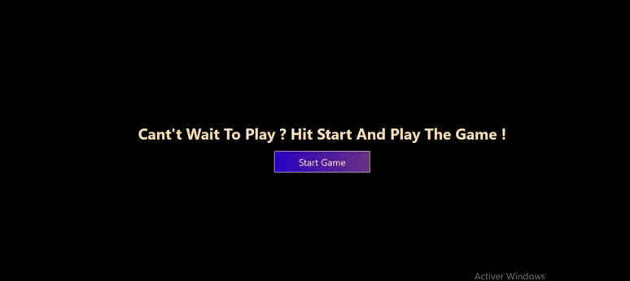

# Fun-Memory-Card-Game

Project developed using **HTML**, **CSS**, **Vanilla JavaScript.**

# Game Rules

- users must find all matching pairs of cards to score maximum points.
- users have a limited time in each new round.
- At the beginning of each round, the cards are shuffled to randomize the game.
- the score is proportional to the number of matching pairs found.

      

# Game Demo

